<p align="center">
  <picture>
    <source media="(prefers-color-scheme: dark)" srcset="docs/assets/logo_for_dark.png">
    <source media="(prefers-color-scheme: light)" srcset="docs/assets/logo_for_light.png">
    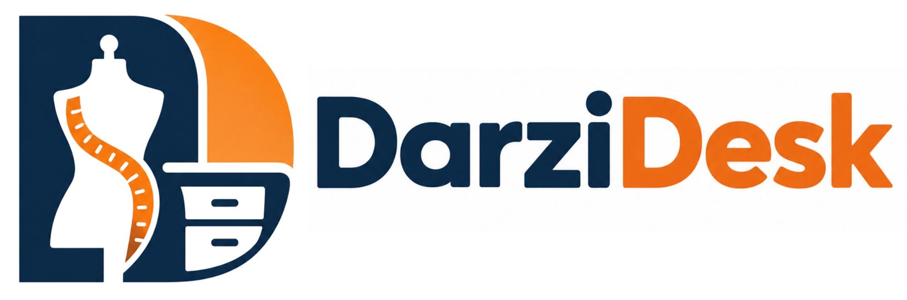
  </picture>
</p>

<p align="center">
  <strong>The Intelligent Operating System & Bespoke Atelier Management Platform for Modern Tailors</strong>
</p>

<p align="center">
  <a href="https://github.com/virajsavaliya/DarziDesk/actions"></a>
  <a href="https://www.typescriptlang.org/"></a>
  <a href="https://react.dev/"></a>
  <a href="https://tailwindcss.com/"></a>
  <a href="https://nodejs.org/"></a>
  <a href="https://www.prisma.io/"></a>
  <a href="https://www.postgresql.org/"></a>
  <a href="LICENSE"></a>
</p>

<p align="center">
  <a href="#-key-features">Key Features</a> •
  <a href="#-visual-tour">Visual Tour</a> •
  <a href="#-system-architecture">Architecture</a> •
  <a href="#-getting-started">Quickstart</a> •
  <a href="#-demo-personas--roles">Demo Roles</a> •
  <a href="#-monorepo-structure">Monorepo Structure</a> •
  <a href="#-security--tenant-isolation">Security & RLS</a>
</p>

---

## 🌟 Overview

**DarziDesk** is an enterprise-grade, multi-tenant SaaS platform engineered specifically for custom tailoring houses, boutique ateliers, and bespoke craft studios (*Darzis*). 

Traditional tailoring studios run on fragmented paper notebooks, manual measurements lost in diary margins, unrecorded fabric cut-offs, manual phone follow-ups, and handwritten paper receipts. **DarziDesk digitizes the entire bespoke garment lifecycle into a single high-performance system:**

- 📐 **Interactive 15-Point Body Mannequin**: Precise anatomical measurements with visual callouts and garment presets.
- 🧵 **Fabric (Kapad) Inventory Ledger**: Meterage reservations, roll tracking, and automated shortage guards.
- 📋 **Artisan Task Queue & Pipeline**: Real-time multi-stage status from Cutting & Stitching to Quality Check & Fitting Trials.
- 💳 **Smart Billing & Partial Payments**: Sequential tax invoicing, deposit receipts, and PDFKit generation.
- 👤 **Self-Serve Customer Portal**: Live order milestones, digital measurement records, and atelier discovery.
- 🛡️ **Dual-Layer Multi-Tenant Security**: Strict application-level scoping combined with PostgreSQL native Row-Level Security (RLS).

---

## 📸 Visual Tour

### 1. Modern Public Landing & Storefront Discovery
A high-converting customer landing page and public atelier directory that introduces bespoke craftsmanship, pricing plans, and direct booking.

<p align="center">
  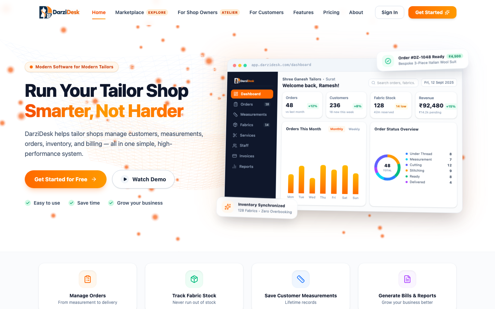
</p>

---

### 2. Atelier Owner Command Center
Real-time dashboard giving tailor shop owners instant oversight of active orders, daily throughput, revenue collected, low-stock fabric alerts, and weekly volume trends.

<p align="center">
  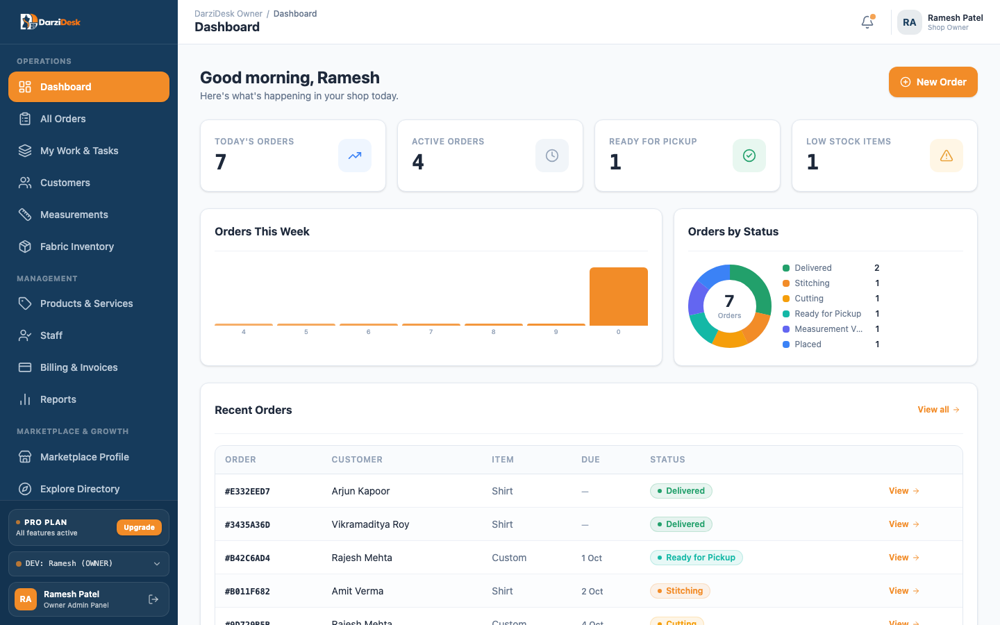
</p>

---

### 3. Interactive 15-Point Visual Measurement Book
Digital body chart supporting 15 anatomical tailoring landmarks (Neck, Shoulder, Chest/Bust, Upper Chest, Waist, Hips, Sleeve Length, Bicep, Wrist, Jacket Length, Trouser Inseam, Outseam, Thigh, Knee, Leg Opening) with toggleable garment presets (Bespoke Suit, Shirt & Polo, Trouser/Pant, Kurta & Ethnic).

<p align="center">
  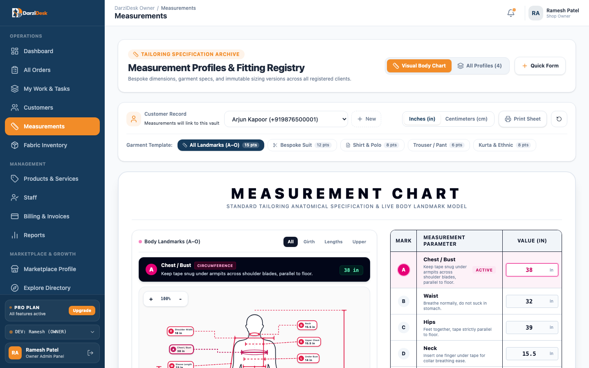
</p>

---

### 4. Bespoke Order Production Pipeline
Comprehensive multi-stage tailoring order management with real-time status tracking, artisan assignment, delivery date monitoring, and workflow filtering.

<p align="center">
  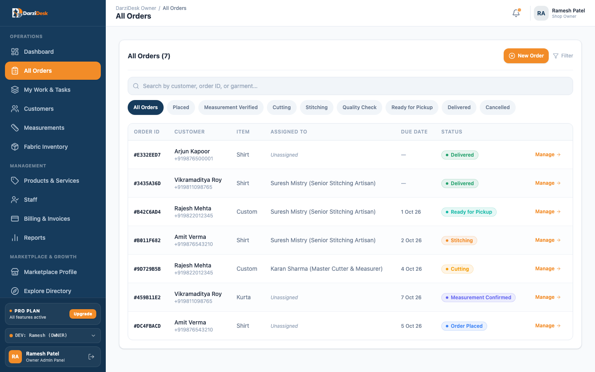
</p>

---

### 5. Fabric (Kapad) Inventory Ledger & Roll Tracking
Accurate meterage management distinguishing available vs. reserved fabric, purchase logs, low-stock threshold badges, and roll tracking to eliminate fabric overbooking.

<p align="center">
  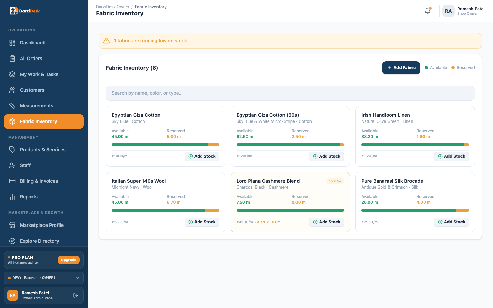
</p>

---

### 6. Billing, Invoicing & Financial Settlement
Automated invoice generation (`INV-SG-XXXX`), tax computations, partial advance deposits, balance due ledgers, and downloadable customer receipts.

<p align="center">
  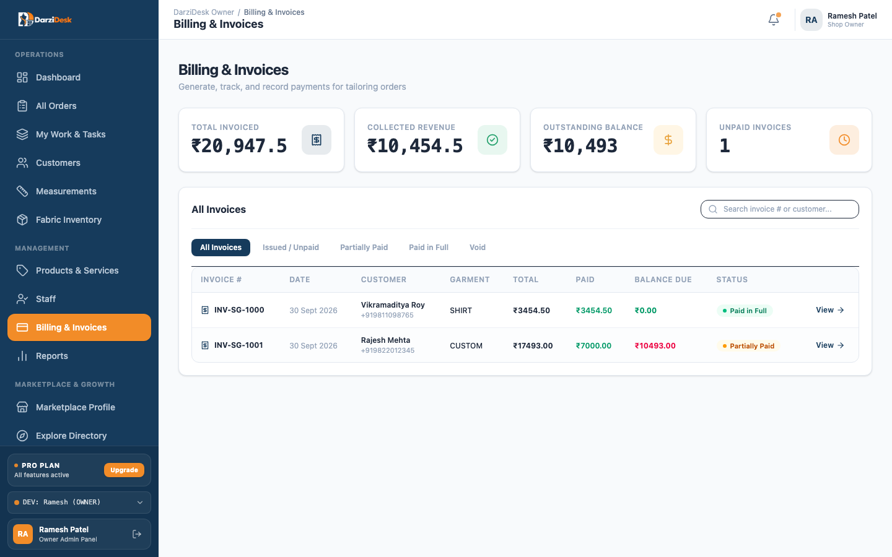
</p>

---

### 7. Customer Bespoke Portal
Client-facing self-service interface where patrons track live production stages of their garments, view measurement profiles, and access payment receipts without needing to call the shop.

<p align="center">
  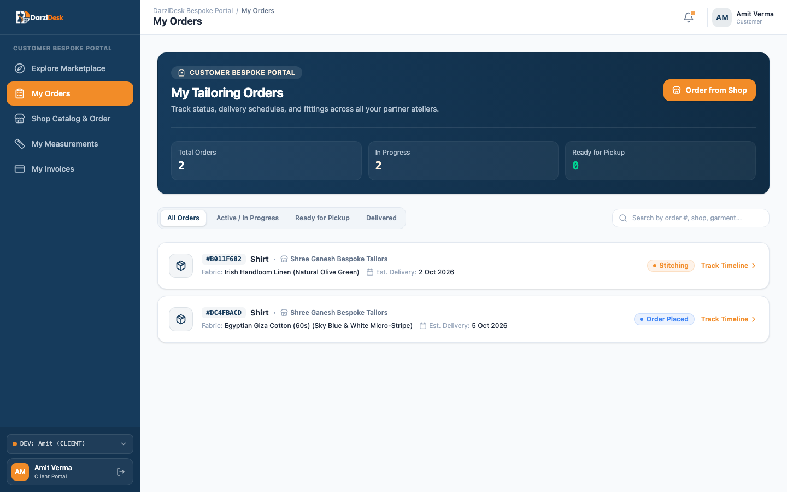
</p>

---

### 8. Platform Super Admin Console
Multi-tenant governance center for monitoring registered ateliers, subscription plan tiers, platform MRR, support sessions, and marketplace moderation.

<p align="center">
  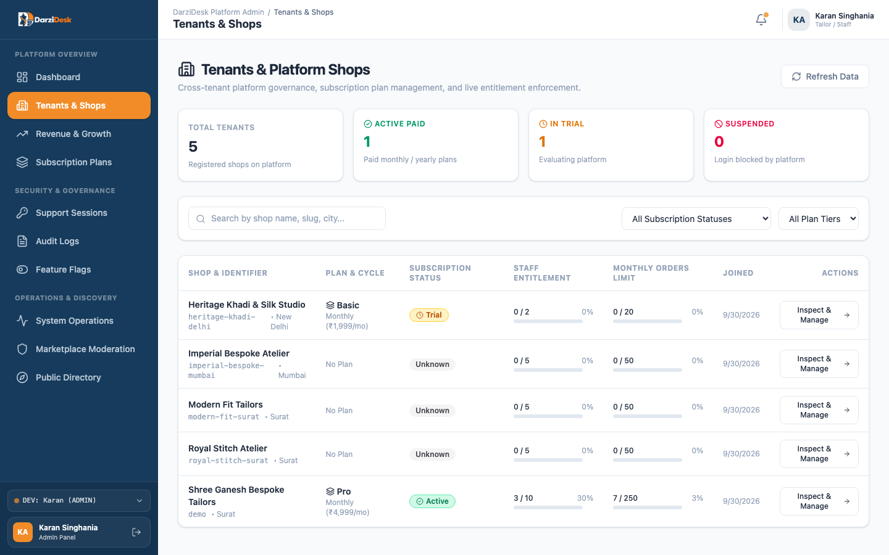
</p>

---

## ⚡ Key Features

| Feature | Description |
|---|---|
| **🎨 15-Point Visual Sizing** | Interactive anatomical mannequin diagram with live measurement callouts, inches/cm conversion, and print-ready measurement slips. |
| **🔄 Complete Order State Machine** | Strict multi-stage lifecycle: `PLACED` ➔ `MEASUREMENT_CONFIRMED` ➔ `CUTTING` ➔ `STITCHING` ➔ `QUALITY_CHECK` ➔ `READY_FOR_TRIAL` ➔ `DELIVERED`. |
| **✂️ Artisan Task Queue** | Dedicated task workbenches for Master Cutters and Senior Stitchers with role-specific garment instructions. |
| **🧵 Fabric Meterage Ledger** | Real-time calculation of available, reserved, and consumed meterage with automated deduction upon cutting confirmation. |
| **🧾 Tax Invoicing & PDF Generation** | Professional sequential invoice generation, GST/sales tax calculation, partial advance receipts, and automated PDF downloads. |
| **📲 Multichannel Notifications** | Event-driven notification dispatch pipeline for order confirmations, trial readiness, and delivery updates via WhatsApp, SMS, and Email. |
| **🏬 Public Marketplace** | Location-aware atelier storefront directory allowing customers to discover master tailors, view service menus, and submit custom commissions. |
| **🛡️ Dual-Layer Multi-Tenancy** | Zero-leakage data isolation combining Prisma query filtering with transaction-scoped PostgreSQL Row-Level Security (`SET LOCAL app.tenant_id`). |
| **🔑 Zero-Trust Header Architecture** | Client-supplied tenant IDs are strictly stripped; tenant context is authenticated server-side exclusively from signed JWTs. |

---

## 🏗️ System Architecture

DarziDesk is built as an npm workspaces monorepo with clean domain boundaries:

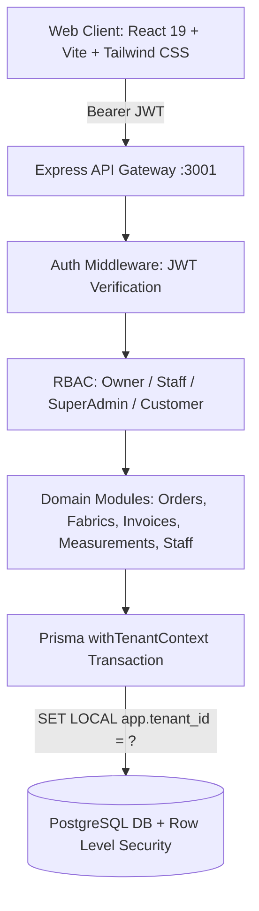

### Multi-Tenant Isolation (Dual-Layer Defense)

1. **Layer 1 (Application Scoping)**:
   - Every tenant database query enforces `where: { tenantId }`.
   - `tenantId` is extracted strictly from the validated JWT payload (`res.locals.auth.tenantId`).
   - Injected client headers (e.g. `x-tenant-id`) are discarded.

2. **Layer 2 (PostgreSQL Native RLS)**:
   - Database tables enforce Row-Level Security policies.
   - Wrapped inside `prisma.ts` via `withTenantContext`:
     ```sql
     SELECT set_config('app.tenant_id', current_tenant_id, true);
     ```
   - Even if an application query omits a tenant filter, PostgreSQL prevents cross-tenant data leakage at the database engine level.

---

## 🔄 Order Lifecycle State Machine

```mermaid
stateDiagram-v2
    [*] --> PLACED: Customer commissions order
    PLACED --> MEASUREMENT_CONFIRMED: Master tailor verifies fit specifications
    MEASUREMENT_CONFIRMED --> CUTTING: Fabric reserved & allocated to Master Cutter
    CUTTING --> STITCHING: Cutter slip generated & assigned to Stitching Artisan
    STITCHING --> QUALITY_CHECK: Garment crafted & submitted to inspection
    QUALITY_CHECK --> READY_FOR_TRIAL: QA passed; customer notified for trial fitting
    READY_FOR_TRIAL --> DELIVERED: Final trial approved & balance settled
    DELIVERED --> [*]
```

---

## 📂 Monorepo Structure

```
Darzi_desk/
├── apps/
│   ├── backend/                     # Node.js + Express + TypeScript + Prisma
│   │   ├── prisma/
│   │   │   ├── schema.prisma        # Database schema definitions & enums
│   │   │   └── migrations/          # PostgreSQL migrations + RLS policies
│   │   ├── src/
│   │   │   ├── lib/                 # Prisma client singleton & RLS context wrapper
│   │   │   ├── middleware/          # JWT auth, RBAC, error handler, rate limiter
│   │   │   ├── modules/             # Auth, customers, fabrics, invoices, measurements,
│   │   │   │                        # notifications, orders, portal, staff, dev seeder
│   │   │   └── scripts/             # Database reset & workflow test seeders
│   └── frontend/                    # React 19 + Vite + TypeScript + Tailwind CSS v4
│       ├── public/                  # Static assets & favicons
│       └── src/
│           ├── assets/              # High-res logos, atelier imagery, avatars
│           ├── components/
│           │   ├── admin/           # Super Admin platform views
│           │   ├── common/          # Reusable UI primitives (StatusBadge, Drawer)
│           │   ├── dashboard/       # Orders Kanban, Visual Mannequin, Analytics
│           │   ├── invoices/        # Billing ledger, payment modal, invoice receipt
│           │   ├── landing/         # Marketing landing pages, marketplace, auth
│           │   ├── layout/          # Responsive Sidebar, Navbar, AppShell
│           │   └── portal/          # Customer self-serve portal views
│           └── types/               # Frontend domain definitions
├── packages/
│   └── types/                       # Shared TypeScript contracts & interfaces
├── docs/
│   ├── architecture.md              # Canonical architectural reference
│   ├── design.md                    # Design tokens, color palette, UI principles
│   ├── saas_product_and_super_admin_guide.md # SaaS subscription guide
│   └── assets/                      # Readme screenshots & branding assets
├── docker-compose.yml               # Local PostgreSQL container service
└── package.json                     # Monorepo workspace configuration
```

---

## 🚀 Getting Started

### Prerequisites

- **Node.js**: 20 LTS (`.nvmrc` included)
- **npm**: 10+
- **PostgreSQL**: Docker Desktop or local PostgreSQL instance (Postgres.app / Homebrew)

### 1. Clone & Install

```bash
git clone https://github.com/virajsavaliya/DarziDesk.git
cd DarziDesk

# Switch to supported Node 20 LTS
nvm use

# Install dependencies across all workspaces
npm install
```

### 2. Configure Environment

```bash
cp apps/backend/.env.example apps/backend/.env
```

*The default `.env` is pre-configured for local development with `localhost:5432`.*

### 3. Start Database & Apply Schema

If using Docker:
```bash
docker compose up -d
```

Push Prisma schema and generate client:
```bash
npm run db:generate --workspace=apps/backend
npx prisma db push --schema=apps/backend/prisma/schema.prisma
```

### 4. Seed Workflow Test Data

Populate the database with realistic bespoke ateliers, fabric inventory, measurement profiles, and multi-stage active orders:
```bash
npx tsx apps/backend/src/scripts/reset_and_seed.ts
```

### 5. Launch the Application

In two terminal sessions (or run concurrently):

```bash
# Terminal 1: Backend API Server (:3001)
npm run dev:backend

# Terminal 2: Frontend Client (:5173)
npm run dev:frontend
```

- **Frontend Application**: [http://localhost:5173](http://localhost:5173)
- **Backend API**: [http://localhost:3001](http://localhost:3001)
- **API Health Check**: [http://localhost:3001/api/health](http://localhost:3001/api/health)

---

## 👥 Demo Personas & Roles

The seeded database comes with pre-configured personas to test all role-based permissions and workflows across the atelier:

| Persona | Role | Portal / Scope | Primary Capabilities |
|:---|:---|:---|:---|
| **Ramesh Patel** | `SHOP_OWNER` | Business Portal | Full atelier command center, revenue metrics, orders Kanban, fabric inventory, staff roster, and invoices. |
| **Karan Sharma** | `STAFF` (Cutter) | Business Portal | Master cutter workbench, anatomical measurements, cutting station assignments, and cutter slips. |
| **Suresh Mistry** | `STAFF` (Stitcher) | Business Portal | Stitching artisan queue, garment assembly stages, and quality inspection workflows. |
| **Priya Dave** | `STAFF` (Sales) | Business Portal | Front desk customer intake, fabric meterage lookup, and bespoke order commission. |
| **Amit Verma** | `CUSTOMER` | Customer Portal | Self-serve bespoke portal, live milestone tracking, measurement archive, and invoice receipts. |
| **Karan Singhania** | `SUPER_ADMIN` | Platform Admin | Platform-wide tenant management, subscription tier oversight, MRR analytics, and atelier approvals. |

> 💡 **Quick Dev Switching**: In development mode, you can instantly alternate between personas using the **Role Switcher** in the bottom left of the dashboard sidebar without needing to type credentials. Test accounts are configured via the local seeder script (`apps/backend/src/scripts/reset_and_seed.ts`).

---

## 🛠️ Monorepo Scripts

| Command | Workspace | Description |
|---|---|---|
| `npm run build` | Root | Builds backend, frontend, and shared types packages |
| `npm run typecheck` | Root | Runs `tsc --noEmit` across all workspaces |
| `npm run lint` | Root | Executes ESLint validation across all workspaces |
| `npm run test` | Backend | Runs Vitest unit and integration test suites |
| `npm run dev:backend` | Backend | Starts Express API with hot-reloading on port 3001 |
| `npm run dev:frontend` | Frontend | Starts Vite dev server with HMR on port 5173 |

---

## 🛡️ Security & Quality Standards

- **Tenant Isolation**: Tested and enforced with strict PostgreSQL RLS policies and automated cross-tenant leakage test suites.
- **Authentication**: Stateless HMAC-SHA256 JWT tokens with segregated `darzi:staff` and `darzi:customer` token namespaces.
- **Password Hashing**: Secure Argon2id password hashing with custom salt and memory cost parameters.
- **Input Validation**: End-to-end request validation using Zod schemas on all API inputs.
- **CI Automation**: GitHub Actions runs linting, type-checking, and build validation on every push and PR.

---

## 📄 License & Author

Distributed under the **MIT License**. See [`LICENSE`](LICENSE) for more information.

- **Author & Maintainer**: **Viraj Savaliya** ([@virajsavaliya](https://github.com/virajsavaliya)) • [virajsavaliya@gmail.com](mailto:virajsavaliya@gmail.com)
- **Repository**: [https://github.com/virajsavaliya/DarziDesk](https://github.com/virajsavaliya/DarziDesk)

## 🤝 Community & Governance

- 📘 [Contributing Guidelines](CONTRIBUTING.md) — Setup guide, conventional commits, PR process
- 📜 [Code of Conduct](CODE_OF_CONDUCT.md) — Contributor Covenant v2.1
- 🔒 [Security Policy](SECURITY.md) — Vulnerability reporting and disclosure SLA

<p align="center">
  Crafted with passion by <strong>Viraj Savaliya</strong> for bespoke tailoring ateliers worldwide.
</p>
