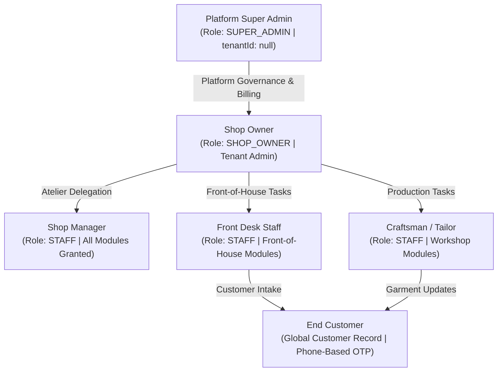
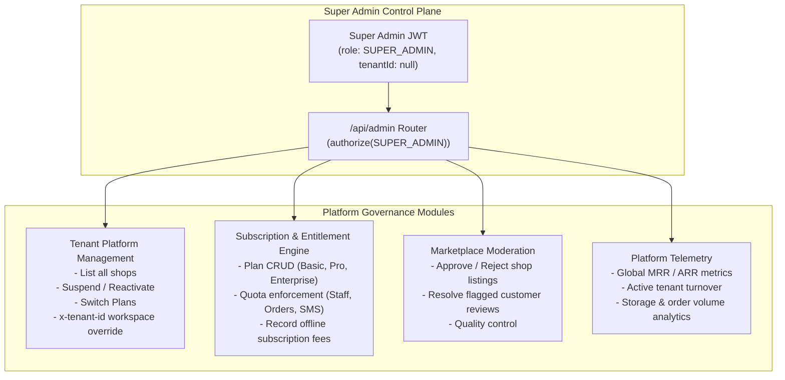
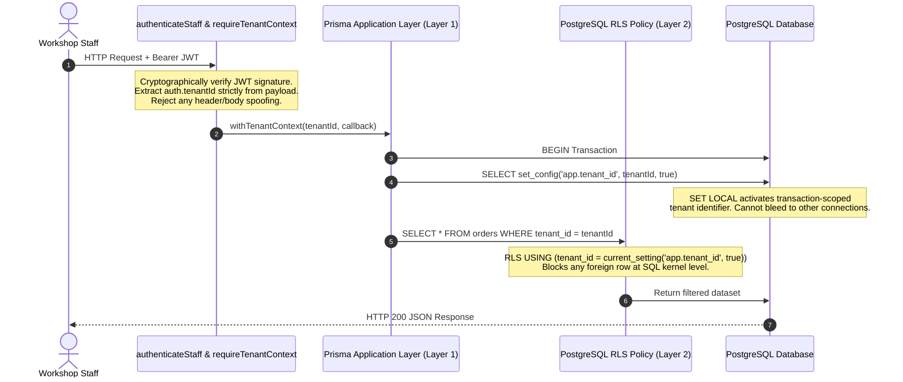

# DarziDesk: SaaS Product Architecture & Platform Super Admin Governance Guide

This document provides the definitive specification of the **DarziDesk** SaaS platform: how the product operates end-to-end for ateliers and customers, and how the **Platform Super Admin** commands full operational control, tenant management, subscription lifecycle, and multi-tenant security.

---

## 1. Executive Summary & Product Vision

### 1.1 The Industry Problem
Custom tailoring and bespoke apparel manufacturing (from bespoke suit ateliers and bridal lehenga boutiques to high-volume uniform makers) traditionally rely on fragmented, error-prone manual operations:
- **Paper registers & measurement diaries** get worn, misplaced, or misinterpreted by cutting masters.
- **Fabric inventory (Kapad)** suffers unrecorded scrap losses, roll misplacement, and over-allocation.
- **Production blindness**: Workshop craftsmen work in silos without clear stage queues, while end customers flood shops with phone calls asking *"Is my suit ready yet?"*.
- **Billing discrepancies**: Missing advance payment records, uncollected balances upon delivery, and lack of itemized GST taxation.

### 1.2 The DarziDesk Solution
DarziDesk is a modern, cloud-native **B2B2C Multi-Tenant SaaS platform** engineered specifically for the bespoke tailoring ecosystem. It unites:
1. **Atelier Back-Office**: Fabric inventory ledger, customer profiles, 15-landmark anatomical measurement capture, itemized billing, and financial turnover analytics.
2. **Workshop Production Floor**: Touch-friendly 7-stage tailoring pipeline, active craftsman assignments, and stage transition tracking.
3. **Customer Live Experience**: Phone-authenticated live tracking portal showing real-time garment status without phone calls.
4. **Public Marketplace**: Geo-located boutique discovery connecting verified ateliers with customers seeking custom attire.
5. **Platform Super Admin Plane**: Centralized governance controlling tenants, users, subscriptions, marketplace listings, and platform-wide revenue telemetry.

---

## 2. System Personas & Role Hierarchy



| Persona | Role Identifier | Tenant Scope | Core Responsibilities |
| :--- | :--- | :--- | :--- |
| **Platform Super Admin** | `SUPER_ADMIN` | Global (None / Null) | Oversees entire platform, manages all tenants, provisions subscription plans, overrides status, moderates marketplace, inspects global revenue and audit logs. |
| **Shop Owner** | `SHOP_OWNER` | Single Tenant | Full administrative control over their atelier: hires/deletes staff, sets access permissions, manages pricing rules, views revenue reports, manages subscription. |
| **Shop Manager** | `STAFF` (Manager Archetype) | Single Tenant | Delegated owner capabilities: manages orders, inventory, customers, invoices, and payments. Blocked from owner-only subscription changes and shop deletion. |
| **Workshop Craftsman** | `STAFF` (Craftsman Archetype) | Single Tenant | Focused strictly on production: receives assigned cutting/stitching tasks, inspects anatomical measurement charts, consumes fabric from ledger, advances stage. |
| **Front Desk Staff** | `STAFF` (Front Desk Archetype) | Single Tenant | Books walk-in customers, captures body measurements, generates invoices, and records cash/UPI/card payments. Restricted from staff management and financial reports. |
| **Customer** | `CUSTOMER` (Global Identity) | Multi-Shop Linkable | Views live order status, inspects saved body measurements across garments, reviews invoices and receipts, explores public tailor marketplace. |

---

## 3. End-to-End SaaS Business Workflows

### Workflow 1: Customer Onboarding & Fabric (Kapad) Inventory Ledger
1. **Customer Intake**: Front desk or owner enters the customer's phone number and name. If the customer already exists globally in DarziDesk, a `ShopCustomerLink` is established to preserve past measurements while isolating shop-private notes.
2. **Fabric Roll Booking**:
   - Fabric rolls are cataloged with SKU, fabric type (e.g., Italian Wool, Egyptian Cotton, Pure Silk), color, width, purchase cost per meter, and retail price per meter.
   - When an order is placed, meters are automatically moved from `availableMeters` to `reservedMeters` via a transactional `FabricStockTransaction`.
   - Once the cutting master cuts the pattern, the meters are moved to `consumedMeters`. Any remnant scraps or defects are logged in the ledger.

### Workflow 2: 15-Landmark Anatomical Body Measurement Capture
1. **Interactive Visual Mannequin**:
   - Master tailors capture measurements through an interactive SVG anatomical body silhouette.
   - 15 master anatomical landmarks (`A` to `O`) span the human body:
     - **Left Zone**: `E` Shoulder Width, `A` Chest / Bust, `M` Sleeve Length, `N` Wrist, `O` Waist to Floor, `I` Lower Leg.
     - **Center**: `B` Waist, `C` Hips (centered outside silhouette).
     - **Right Zone**: `D` Neck, `K` Upper Chest, `L` Under Bust, `F` Front Torso Length, `G` Inseam, `H` Knee, `J` Full Height.
2. **Fit Preferences & Allowances**:
   - Supports unit toggling (`INCHES` vs `CM`) and fit profiles (`SLIM`, `REGULAR`, `LOOSE`).
   - Every modification creates an immutable `MeasurementProfileVersion` record, ensuring historical auditing for repeat orders.

### Workflow 3: 7-Stage Bespoke Workshop Production Pipeline
DarziDesk replaces confusing status codes with an intuitive, 7-stage production state machine:

```
[1. Order Placed] ──> [2. Measurements Verified] ──> [3. Cutting Fabric] ──> [4. Stitching Garment]
                                                                                   │
[7. Delivered] <── [6. Ready for Pickup] <── [5. Quality Check] <──────────────────┘
```

- **Craftsman Assignment**: Orders are assigned to specific workshop staff (Cutting Master, Tailor, Finisher) via `PATCH /api/orders/:id/assign`.
- **Live Stage Advancement**: When a craftsman finishes cutting or stitching, tapping the primary advance button updates the order status, records an immutable `OrderStatusLog`, and automatically notifies the customer.

### Workflow 4: Itemized Invoicing, GST Taxation & Split Payments
1. **Automated Bill Calculation**:
   - Invoices combine itemized stitching labor + consumed fabric charges.
   - Calculates subtotal, applies shop-configured GST/VAT percentage (`taxRatePercent`), and computes final total.
2. **Multi-Method Payment Recording**:
   - Supports partial deposits (e.g., 50% advance upon order placement, 50% on trial/delivery).
   - Segmented payment recording: **Cash**, **UPI / QR Code**, **Bank Transfer**, **Card**.
   - Automated balance calculation prevents overpayment and provides instant PDF receipts via PDFKit.

### Workflow 5: Customer Live Portal & Public Marketplace
- **Live Tracking Portal**: Customers log in via phone number + OTP (no complex passwords needed). They view a visual progress bar of their garment, trial dates, outstanding balances, and master tailor notes.
- **Public Marketplace**: Geo-located search allows prospective clients to discover top-rated bespoke tailors by city, distance, and garment specialty (Bespoke Suits, Wedding Sherwanis, Handloom Kurtas).

---

## 4. Platform Super Admin: Architecture & Control Plane

The **Platform Super Admin** is the supreme administrative authority of the DarziDesk ecosystem. Unlike shop owners who are scoped to a single `tenantId`, the Super Admin exists outside any single tenant (`tenantId = null`).



### 4.1 Tenant Platform Management (`/api/admin/tenants`)
- **Global Tenant Discovery**: `GET /api/admin/tenants?search=...&planId=...&status=...&page=1&limit=20` returns all registered shops across the platform with active subscription state, total staff count, and order volumes.
- **Deep Tenant Inspection**: `GET /api/admin/tenants/:id` displays comprehensive atelier metrics: owner email, creation date, registered staff roster, subscription tier, and lifetime revenue.
- **Instant Tenant Suspension**: `POST /api/admin/tenants/:id/suspend` immediately sets `isActive: false`. The middleware rejects any incoming requests from the suspended shop's owner and staff with `TENANT_SUSPENDED`.
- **Tenant Reactivation**: `POST /api/admin/tenants/:id/reactivate` restores normal atelier operations.
- **Workspace Override (`x-tenant-id`)**: Super Admin can pass `x-tenant-id: <uuid>` to inspect any shop's dashboard, orders, or inventory without knowing user passwords.

### 4.2 Subscription & Entitlement Engine
DarziDesk uses a strict entitlement gating engine to prevent plan abuse and enforce monetization:

| Plan Feature / Quota | Basic Plan | Pro Plan | Enterprise Plan |
| :--- | :--- | :--- | :--- |
| **Monthly Pricing** | ₹1,999 / mo | ₹4,999 / mo | Custom / Enterprise |
| **Max Staff Accounts** | 3 Staff Accounts | 10 Staff Accounts | Unlimited |
| **Max Orders / Month** | 50 Orders | 250 Orders | Unlimited |
| **Measurement Visual Charts** | Included | Included | Included + Custom Landmarks |
| **Fabric Kapad Ledger** | Standard | Advanced Scrap Ledger | Multi-Warehouse Stock |
| **Public Marketplace** | Not Eligible | Listed & Verified | Featured Priority Placement |
| **SMS / WhatsApp Alerts** | 100 Credits | 500 Credits | 2,500 Credits |

#### Super Admin Plan Controls:
- `POST /api/admin/plans`: Create new subscription tiers with custom quotas and pricing.
- `PUT /api/admin/plans/:id`: Update existing plan specifications, pricing, or feature lists.
- `POST /api/admin/tenants/:id/change-plan`: Instantly upgrade or downgrade a shop's plan (e.g. from Basic to Pro).
- `POST /api/admin/tenants/:id/payments`: Record off-platform subscription payments (Cash, Cheque, NEFT/RTGS) and advance `currentPeriodEnd`.

### 4.3 Public Marketplace Moderation (`/api/admin/marketplace`)
To protect platform reputation and ensure quality:
- **Shop Approval Queue**: Newly listed ateliers enter `PENDING_REVIEW` status. Super Admin inspects photos, address, and specialty tags via `GET /api/admin/marketplace/pending`.
- **Approve Listing**: `POST /api/admin/marketplace/:tenantId/approve` publishes the boutique to the public marketplace.
- **Reject Listing**: `POST /api/admin/marketplace/:tenantId/reject` requires a written rejection reason sent to the shop owner.
- **Review Moderation**: Customers or shop owners can flag abusive or fake reviews. Super Admin reviews them at `GET /api/admin/marketplace/flagged-reviews` and can dismiss the flag or permanently delete the review via `POST /api/admin/marketplace/reviews/:id/resolve`.

### 4.4 Global Revenue & Telemetry Dashboard (`/api/admin/revenue/summary`)
Super Admin has access to cross-tenant platform health metrics:
- **Monthly Recurring Revenue (MRR)**: Real-time calculation across all active paid subscriptions.
- **Annual Recurring Revenue (ARR)**: Projected annualized baseline.
- **Tenant Breakdown**: Count of active shops, trial shops, past-due shops, and churned/suspended shops.
- **Order Flow Volume**: Platform-wide count of garments actively in production across all ateliers.

---

## 5. Security & Tenant Isolation Architecture

Multi-tenant security in DarziDesk is designed with **zero-trust isolation** to guarantee that Shop A can never view, modify, or leak data belonging to Shop B.

### 5.1 Dual-Layer Isolation Mechanism



1. **Layer 1 (Application-Level JWT Context)**:
   - Sourced strictly from cryptographically verified JWT (`res.locals.auth.tenantId`).
   - Every service query automatically injects `where: { tenantId }`.
   - Never trusts client-supplied query parameters, body payloads, or headers for tenant identification.
2. **Layer 2 (Database-Level PostgreSQL Row Level Security - RLS)**:
   - Database tables (`orders`, `fabrics`, `measurements`, `invoices`, `users`) have PostgreSQL RLS enabled.
   - Every query runs inside `withTenantContext(tenantId, tx)` which executes:
     ```sql
     SELECT set_config('app.tenant_id', $tenantId, true);
     ```
   - The `true` parameter makes the setting **transaction-local (`SET LOCAL`)**. As soon as the transaction commits or aborts, the setting is destroyed. It cannot bleed into pooled connections.
   - The Postgres RLS policy automatically rejects any query attempting to touch a row where `tenant_id != current_setting('app.tenant_id', true)`.

### 5.2 Granular Role-Based Access Control (RBAC)
Within each tenant, access is strictly governed by user roles and permission sets:
- **`SHOP_OWNER`**: Unrestricted access to all tenant modules.
- **`STAFF`**: Controlled by the 8-module permission matrix configured during staff creation:
  1. `orders`: Workshop task list and stage advancement.
  2. `measurements`: Viewing and recording body measurement charts.
  3. `fabrics`: Viewing stock meter balances and logging usage.
  4. `customers`: Browsing customer profiles and contact details.
  5. `invoices`: Issuing itemized bills and receipts.
  6. `payments`: Collecting and recording cash/UPI payments.
  7. `reports`: Shop financial analytics and turnover reports.
  8. `settings`: Atelier administration and staff roster.

### 5.3 Cryptographic Standards & Credentials
- **Password Hashing**: Industry-standard **Argon2id** algorithm with dedicated salt, high memory cost (64MB), and multi-threading parameters to prevent brute-force attacks.
- **Token Signing**: Stateless JSON Web Tokens (JWT) signed with HMAC-SHA256 / RSA secret, short TTL expiry (15-minute access, refresh token rotation).
- **Tenant-Scoped Unique Constraints**:
  ```prisma
  @@unique([tenantId, email])
  ```
  Allows a tailor who works at Atelier A and Atelier B to register with the same email address while keeping their workspaces strictly separated.

### 5.4 Network & Perimeter Hardening
- **Rate Limiting**: Tiered IP and credential rate-limiting via `express-rate-limit` prevents credential-stuffing and denial-of-service:
  - Auth endpoints (`/api/auth/*`): 10 requests per 15-minute window.
  - General API endpoints: 100 requests per minute per IP.
- **HTTP Security Headers**: Powered by `helmet` to enforce strict Content Security Policy (CSP), HTTP Strict Transport Security (HSTS), and anti-clickjacking headers (`X-Frame-Options: SAMEORIGIN`).
- **Input Sanitization**: 100% of incoming payloads are parsed and validated against strict **Zod schemas** before reaching service logic. Unrecognized fields are stripped.

---

## 6. Comprehensive API Routing Architecture

```
/api
├── /admin                           # Strictly Super Admin (SUPER_ADMIN role only)
│   ├── /tenants                     # Tenant listing, inspection, plan change, suspend, reactivate
│   ├── /plans                       # Subscription plan creation, modification, pricing
│   ├── /marketplace                 # Listing approvals, rejection, review moderation
│   └── /revenue/summary             # Platform MRR, ARR, active tenant metrics
├── /auth
│   ├── /login                       # Staff & Owner authentication
│   ├── /register                    # Shop self-service registration (14-day trial)
│   ├── /customer/login              # Customer phone OTP login
│   └── /password-reset              # Tokenized password reset workflow
├── /orders                          # Bespoke tailoring pipeline & stage transitions
├── /measurements                    # Anatomical profiles, 15 landmarks, version history
├── /fabrics                         # Kapad inventory rolls, meter consumption ledger
├── /customers                       # Shop-linked customer directory & profiles
├── /invoices                        # Itemized bills, GST tax rules, PDF generation
├── /payments                        # Cash, UPI, and Bank transfer payment recording
├── /users                           # Staff management & granular access allocation
├── /reports                         # Atelier turnover, labor vs fabric breakdown, SLA metrics
├── /portal                          # Customer-facing live tracking & self-service
└── /marketplace                     # Public shop discovery & customer reviews
```

---

## 7. Summary

DarziDesk provides a complete, modern operating system for the bespoke apparel industry:
1. **For Ateliers**: Eliminates lost measurements, unrecorded fabric losses, and production guesswork through visual 15-landmark body charts, fabric ledgers, and a touch-friendly 7-stage production tracker.
2. **For Customers**: Delivers transparent real-time garment tracking, automated SMS/WhatsApp alerts, and verified shop discovery.
3. **For Platform Super Admin**: Delivers complete omniscient control over tenant lifecycles, subscription quotas, feature gating, marketplace safety, and platform revenue metrics—all reinforced by unbreakable dual-layer database isolation.
